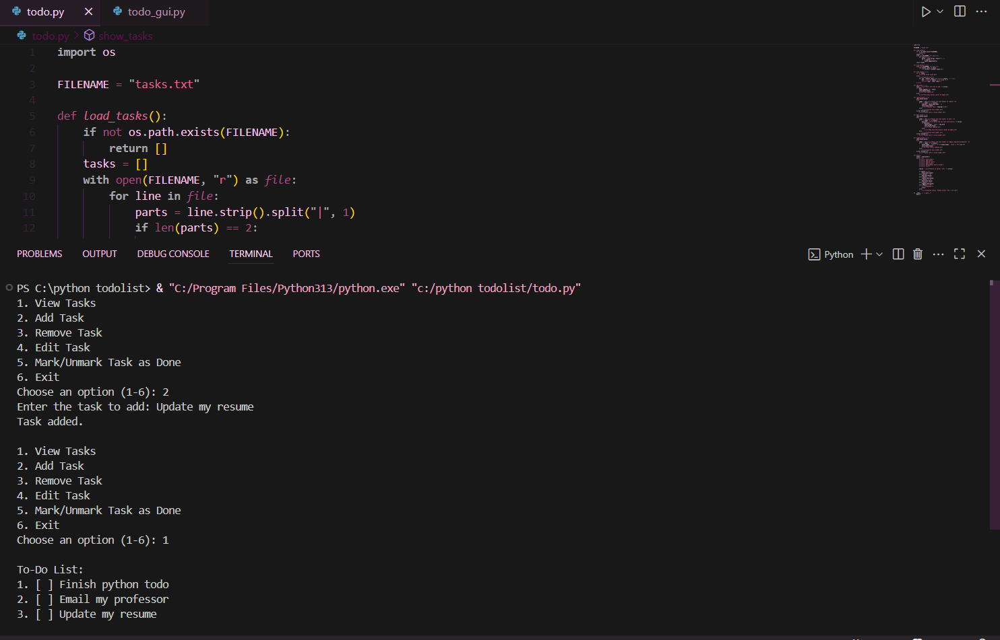
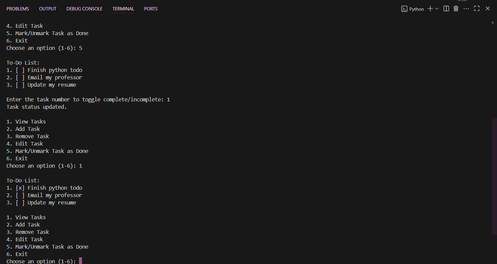
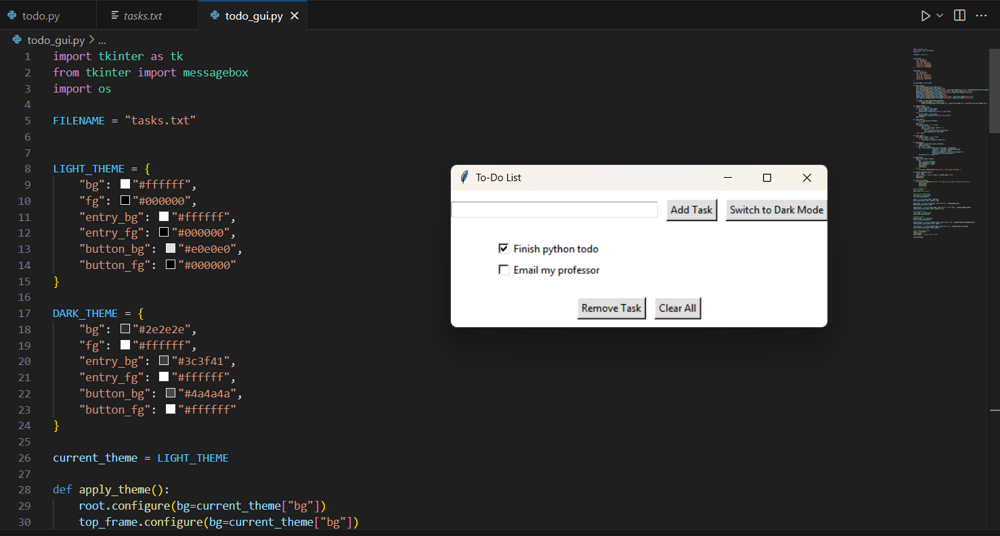
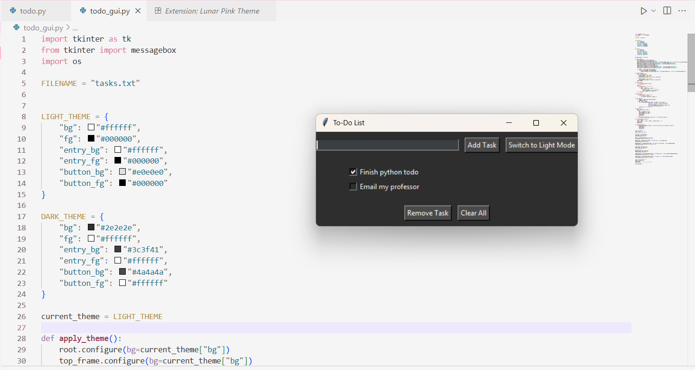

# Python-ToDoList
This project includes two versions of a simple To-Do List application written in Python:

-  **CLI Version** – Console-based task manager with options to add, edit, remove, and mark tasks complete.
-  **GUI Version** – Tkinter-based interface with checkboxes and Light/Dark Mode toggle.

---

## Features

###  GUI Version
-  Add, check/uncheck, and remove tasks
-  Light/Dark mode toggle
-  Tasks saved to `tasks.txt` (persist between sessions)

###  CLI Version
-  View all tasks in the terminal
-  Add new tasks
-  Edit task descriptions
-  Remove tasks by number
-  Mark/unmark as done
-  Saves tasks to the same `tasks.txt` file

---

##  Requirements

- Python 3.13
- No external packages needed
- `tkinter` (comes pre-installed with Python)

##  Screenshots

- CLI Version
**Adding and Viewing Tasks**
 

**Marking Tasks as Done**
 

- GUI Version
**Light Mode**
 

**Dark Mode**
 

